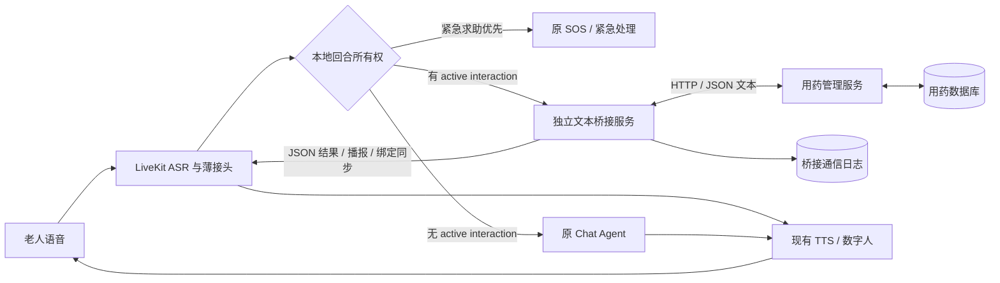

# LiveKit 与用药管理智能体文本桥接实现方案 V1

- 编写日期：2026-09-18
- 文档状态：待审核，尚未实施
- 实施原则：增加独立桥接层，两端仅通过格式化文本通信，尽量复用现有接口。
- 用药项目：`/root/autodl-tmp/Medication_Management_Agent/`
- LiveKit 项目：`/root/autodl-tmp/CODE/agent-starter-python/`
- 参考资料：[实现进度](./实现进度.md)、[项目 README](./README.md)。

> 本文是第一版实施设计，不代表相关功能已经实现或通过验证。本版已按四项 P0 审核意见修订；本轮只修改方案文档，不实施代码、不安装依赖、不启动服务。实现进度文档作为现状参考，其后续任务不自动纳入本次范围。

## 1. 目标与结论

采用“独立文本桥接服务 + LiveKit 薄接头”的接入方式。

用药管理智能体继续管理计划、审批、调度、交互有效期和服药状态。LiveKit 继续提供语音识别、TTS、数字人和普通对话。桥接层负责会话路由、文本协议转换、提醒获取、回复转发及播放回执转发。

双方不共享数据库，不导入对方代码，不传递音频、模型实例或 Python 对象。跨服务边界只传 UTF-8 JSON 文本。

LiveKit 本地维护 `active_medication_interaction`，在默认 Chat Agent 响应前决定回合所有权。Text Bridge 不承担普通聊天分类器，也不进入普通聊天同步主链路：

```text
无 active medication interaction：ASR → 原 Chat Agent（不调用 Bridge）
有 active medication interaction：ASR → Bridge → Medication API → Bridge Result
SOS / 紧急求助：优先走 LiveKit 原紧急处理路径，不等待 Bridge
```

Medication API 只在回复明确且需要业务处理时调用；澄清不写业务状态。试点老人采用新旧用药 ownership 互斥，普通聊天及其他非用药能力不受此 gate 影响。

第一阶段打通以下闭环：

```text
工作台创建并审批计划
  → 用药服务调度到点
  → 桥接层获取提醒
  → 已连接的 LiveKit 会话播报
  → 老人回复
  → LiveKit 本地确认当前 binding 并接管回合
  → 同步委派文本给桥接层，以 StopResponse 阻断默认响应
  → 用药服务记录处理结果
  → LiveKit 播报结果
  → 工作台显示更新后的状态
```

“只加桥梁”可以显著缩小修改范围，但不能承诺 LiveKit 完全零修改：当前代码缺少面向外部桥梁的通用播报和回合接管接口，需要少量装配及委派代码。

## 2. 当前代码事实

### 2.1 用药管理服务

已有接口可支持提醒查询、回复处理和设备事件回写：

| 接口 | 用途 |
|---|---|
| `GET /api/v1/medication/notifications?elder_id=...` | 查询打开且未过期的提醒 |
| `GET /api/v1/medication/occurrences/{id}` | 查询任务、提醒尝试和交互详情 |
| `GET /api/v1/medication/plans/{id}` | 查询计划各版本，用于核对对应版本是否有效 |
| `POST /api/v1/medication/responses` | 处理已服用、延后、跳过、重复播报 |
| `POST /api/v1/medication/device-events` | 记录播报开始、完成、失败、打断 |
| `POST /api/v1/medication/agent/message` | 自然语言计划及回复入口，V1 不默认用于任意对话 |

现有 `device.interaction.request` 发布器只把尝试标记为 `dispatched`，不会调用真实 TTS。`published` 和 `dispatched` 均不能作为已经播出的证明。

当前代码已经增加三方工作台、dashboard 和独立 Outbox 发布线程，较 2026-09-12 的进度文档有更新；真实设备桥接仍未实现。

### 2.2 LiveKit

- `src/agent.py` 创建 `AgentSession`，装配 ASR、TTS、数字人及房间生命周期。
- `src/assistant.py` 已有 `on_user_turn_completed` 回合钩子，可作为文本委派位置。
- `src/room_lifecycle.py` 已有 `proactive` 主动托管会话，但目前进入旧提醒和打卡流程。
- `session.say()` 可播报指定文本；本地锁定及安装的 LiveKit Agents 为 1.6.5。
- 已有回声、音乐、说话人等输入过滤，需要保留其既有作用。

现有 `medication_checkin` 使用旧系统 `reminder_id`，新服务使用 `interaction_id` 和 `occurrence_id`。V1 不在两种 ID 之间强行转换，不把同一次回复同时送到两套打卡系统。

## 3. 第一阶段范围

### 3.1 纳入范围

1. 一个桥接进程、一个测试老人、一台设备、一场已建立的 LiveKit 会话。
2. 计划在现有用药工作台创建、审批。
3. 桥接服务轮询打开的提醒，向绑定会话下发固定正文。
4. 对当前提醒处理明确的“吃了、晚点、跳过、再说一遍”。
5. 多条提醒串行播报和处理，始终明确当前交互；“都吃了”先澄清。
6. 无有效本地用药交互时，普通聊天直接进入原流程，不请求 Bridge；已接管回合不再进入旧用药工具。
7. 播报生命周期回写、业务请求幂等、有限重试、故障提示。
8. 功能默认关闭，按测试老人启用；试点期间旧用药主动播报和旧用药工具受本地 ownership gate 限制。

### 3.2 暂不纳入

- 音箱待机唤起、自动建房入房及 data-cloud 改造。
- Redis Streams、多实例桥接、跨设备或跨房间竞争领取。
- 语音创建、修改、审批用药计划及全面替换旧用药系统。
- 任意自然语言回复的模型分类、多轮复杂澄清。
- PostgreSQL 迁移、统一账号体系和完整多租户改造。
- 旧计划或历史数据迁移。
- 承诺播放恰好一次、证明老人实际听见或实际吞服。

未建立会话时，V1 不记为真实送达，也不假装完成主动唤起。会话建立后仅在交互仍有效时重新核对；已过期提醒不补播。

## 4. 架构与职责



### 4.1 LiveKit 薄接头

- 主动连接桥接服务，注册当前会话。
- 本地维护 `active_medication_interaction`，包含交互 ID、`binding_revision`、有效期和可接管状态；它是 Bridge 编排 binding 的本地镜像，不是用药业务事实。
- 在 `on_user_turn_completed` 中先处理 SOS / 紧急求助和既有本地控制，再检查本地 binding。无有效 binding 时直接继续原 Chat Agent，不调用 Bridge、不等待其连接或健康检查。
- 仅有当前有效 binding 时，才在默认 LLM / Tool 响应前锁定回合所有权并同步委派。对所有已接管回合采用 LiveKit `StopResponse` 阻断默认响应，包括超时、异常和 `pending` 情况。
- 接收 `speak`，用现有 TTS 播报正文，不让聊天模型再次改写；将播放事件与指定消息关联并上报。
- 按测试老人和功能开关阻断旧用药主动播报与旧工具处理；ownership 不因 Bridge 离线而自动解除。
- 会话关闭时清理本地 binding、连接和后台任务。

有效 binding 来自经验证的 `interaction.bind`，必须匹配当前会话及递增修订号，且未过期、未被 clear；不能由任意 ASR 内容创建。本地到期立即失效；Bridge 在调用业务 API 前仍须复查服务端事实。

薄接头不访问用药数据库、不直接调用用药 API。回合在发出请求前即归属用药接头；Bridge 返回处理结果，不决定所有普通聊天的归属。详细阻断语义见第 7.2 节。

### 4.2 桥接服务

- 维护可信身份到会话的映射、串行队列及唯一当前交互。
- 只处理 LiveKit 已绑定并委派的用药回合，进行明确动作映射或澄清；不分类任意普通聊天。
- 用独立的确定性会话状态机管理排队、播放、等待回复和处理回复，向 LiveKit 同步 binding。
- 将用药服务 JSON 转成文本协议，调用 Medication HTTP API，依据实际结果生成固定回复。
- 保存通信去重、在途请求及播放关联，不复制或自行修改用药业务事实。
- 每位测试老人限制一个有效桥接会话，重复注册返回冲突。

### 4.3 用药管理智能体

- 继续作为 reminder / occurrence / interaction、计划有效性、服药状态及审计的唯一事实来源。
- 独占已服用、跳过、延后、过期等业务处理权，校验归属、交互有效期、延后次数和截止时间。
- 保存状态变化、审计记录和 Outbox，不需要了解房间内音视频细节或安装 LiveKit SDK。

“延后”是业务操作：现有实现保持 occurrence 为 `unconfirmed` 并更新 `next_reminder_at`；本文不要求新增 `delayed` 枚举或修改业务状态机。

### 4.4 Bridge 会话级确定性状态机

本状态机只管理当前 LiveKit 会话中的交互编排，与 Medication Service 的业务状态机完全独立。队列和状态迁移在会话级串行执行器或锁内完成；网络请求在锁外执行，返回后核对原会话、binding 修订号及关联 ID。

```text
IDLE → REMINDER_PENDING → PLAYING → AWAITING_RESPONSE → PROCESSING_RESPONSE
         ↑                  ↑               ↑                    │
         └──重复播报──────────┘               └──澄清/可恢复失败────┤
IDLE ←────────服务确认本次交互结束、清理 binding 与输出占用──────────┘
```

| 状态 | 含义与进入条件 | current ID 及退出条件 |
|---|---|---|
| `IDLE` | 当前无编排中的交互，队列可以非空 | 三个 current ID 为空；选取并复查一项后进入 `REMINDER_PENDING` |
| `REMINDER_PENDING` | 已选一项，等待输出让出、binding 确认和播放开始 | 固定 `current_interaction_id`，构造消息时分配 `current_playback_id`，turn ID 为空；尚未 bind 时 LiveKit 无 active binding |
| `PLAYING` | 对应提醒或澄清音频实际开始播放 | 保留交互和播放 ID；播放终止后清空当前播放 ID 并保留历史关联；提醒/澄清正常结束或可继续交互的打断进入 `AWAITING_RESPONSE`，结果收尾话术结束转 `IDLE` |
| `AWAITING_RESPONSE` | 等待当前交互的回复 | 交互 ID 固定，播放和 turn ID 通常为空；接受合法回合后设置 `current_turn_id` 并进入 `PROCESSING_RESPONSE` |
| `PROCESSING_RESPONSE` | 回复正在映射、调用业务 API 或对账 | 固定交互和 turn ID，不激活下一项；结果未知时保持状态；澄清后重新播放问题并等待，REPEAT 回到待播，业务结束后收尾至 `IDLE` |

生命周期和并发规则：

1. 同一会话同一时刻仅允许一个 current interaction 被回复。新提醒只能入队，不覆盖 `current_interaction_id`，不修改正在处理回合的 binding 快照。
2. `interaction.bind` 只在提醒即将取得输出权时发送；确认 LiveKit 安装 binding 后才发送 `speak`。等待原普通对话完成的队列项不能提前劫持该对话。bind 与回合起始判定在 LiveKit 本地串行处理。
3. 轮询发现过期、计划暂停、版本失效或已被服务端处理时，发送撤销，清理本地绑定及待播项；这些判断以服务查询为依据。确认、跳过或延后均由服务执行，Bridge 不通过状态迁移改变业务事实。
4. 结束交互时先 `interaction.clear`，确认 LiveKit 已清理后才允许下一项 bind。延后成功后的后续提醒由服务调度生成，不由 Bridge 自建 interaction。
5. `clarify` 不写业务状态，澄清问题使用新的播放 ID，播完回到等待回复；`REPEAT` 保留交互 ID并创建新的播放 ID。结果确认话术只用于输出收尾：撤销 active binding 后，Bridge 以 `PLAYING` 且 `purpose=result` 保留输出占用，该话术结束转 `IDLE` 而非等待回复；current interaction 此时只用于历史关联，不再可被用户回复。仍需等话术结束才能播下一项。
6. `PLAYING` 或已 bind 的 `REMINDER_PENDING` 中提前到达的合法回复先按原 binding 暂存；播放停止后串行处理，不并行调用 API。V1 不承诺识别所有重叠讲话。
7. `PROCESSING_RESPONSE` 中相同 turn 返回已有进度；不同 turn 返回 `error` / `busy`，不覆盖当前 turn、不并发第二项业务操作，该新回合也不得落入旧工具。
8. `current_turn_id` 在结果明确、持久化且已交给接头后清空；业务结果未知时保留，不能仅因超时释放并重新执行。播放 ID 在播放终止后清空，历史关联留在通信日志。
9. 明确播放失败、交互失效或本地取消时清理 binding 和编排占用。在途业务请求另留恢复记录对账，不能因本地清理假定业务失败；结果未知时保留恢复阻塞标记，不激活下一条用药交互，直到原请求对账完成。无 active binding 的普通聊天仍走原流程。迟到结果只能更新原关联，不推动新交互状态。
10. 本地等待预算不超过 `expires_at`。到期或用户通过 LiveKit 本地明确命令“先聊别的”释放会话占用，只解除本地交互，不调用 SKIP / DELAY。LiveKit 先本地撤销并发送 `interaction.release`，Bridge 确认后以 clear 对齐；断线时保存释放记录并在重连 bind 前同步。该交互在本会话标为已释放，轮询不得立即重新激活；之后的新回合走原聊天。

### 4.5 测试老人范围内的新旧用药 ownership

以会话启动时确定的 `TEXT_BRIDGE_ENABLED + 测试老人白名单` 为 gate。试点老人由新 Bridge 独占新用药交互处理及会话内用药主动播报；不迁移其他老人，不以 Bridge 是否在线动态切换新旧系统。

- **回复互斥**：active binding 存在时不得进入默认模型或旧用药工具；试点老人即使没有 active binding，也禁用旧 `medication_checkin`，不能凭猜测旧提醒编号补打卡。
- **播报互斥**：`room_lifecycle.py` 的旧 `proactive` 分支在注入卡片指令、创建播放任务、提交 `first_utterance` 之前检查 gate；试点老人的旧用药提醒整类阻断，不仅按 ID 或正文去重。
- **工具互斥**：旧工具执行边界再次检查 ownership。旧用药打卡拒绝；通用 reminder 工具仅放行确定为非用药的操作。已有任务按返回的类型/内容核实，新建按本地保守用途规则检查，无法确定时澄清、不写旧系统；不得调用 Bridge 分类普通聊天。
- **非用药能力**：普通聊天、SOS、音乐、天气及明确非用药提醒沿用原流程；不以关闭整个 Chat Agent 或全部 reminder 工具代替用药 gate。
- **故障与回退**：Bridge 超时、离线或 active binding 清空不解除 ownership。退出试点需显式停用并核对旧调度后恢复，避免自动双轨。
- **外部播放边界**：LiveKit 只能阻断经过本 Agent 的旧播报，不能拦截音箱本地或 data-cloud 独立播放。试点前须通过现有管理配置确认同类旧用药调度停用或不存在；否则不满足端到端互斥前提。本轮不改外部系统。

这些 gate 都位于 LiveKit 接入层，不修改 Medication Service 核心业务代码、数据库 schema 或业务状态机。

## 5. 通信与信任边界

### 5.1 传输方式

- LiveKit → 桥接层：主动建立 WebSocket，便于双向下发文本，不新增 LiveKit 入站监听端口。
- 桥接层 → 用药服务：复用现有 HTTP API。
- 本机试点默认监听回环地址；跨主机时使用受保护的网络通道及 WSS/HTTPS。
- LiveKit 侧可复用现有 `aiohttp`。独立桥接进程拟使用 Python 与 `aiohttp`，桥接日志使用标准库 SQLite；具体依赖文件随实施计划审核，不在本文阶段安装。

### 5.2 身份来源

会话注册中的老人、设备身份必须取自已有服务端校验信息，并由桥接服务按测试映射校验。协议字段本身不能证明身份，不能接受任意前端填写的老人 ID。

V1 使用明确的单租户测试配置，不把不同系统中的同名 `elder_id` 视为天然一致。桥接消息可以保留 `tenant_id`，但这不代表用药服务已经支持多租户隔离。

WebSocket 使用独立服务凭证认证；凭证放请求头，不写入正文、URL 或日志。用药 API 当前没有认证授权，V1 仅允许受限的本机测试访问；跨主机或正式使用前需另行确定服务间认证，不直接公开当前 API。

## 6. JSON 文本协议 V1

### 6.1 公共字段

| 字段 | 说明 |
|---|---|
| `version` | 固定为 `"1"` |
| `type` | 消息类型 |
| `message_id` | 全局唯一消息编号；同一消息重试必须保持不变 |
| `session_id` | 本次 LiveKit 会话编号，不等同于老人 ID |
| `reply_to` | 可选，关联被回复的请求 |
| `interaction_id` | 用药回合、绑定及播放消息必须携带；会话注册可省略，普通聊天不发消息 |
| `binding_revision` | 每次绑定/撤销递增的会话内修订号；与交互相关的消息必须携带 |
| `sent_at` | 带时区的 ISO 8601 时间；不作为业务授权依据 |
| `payload` | 类型对应的结构化正文 |

建议单条消息上限 32 KiB，超限或版本不支持时返回协议错误。示例中的所有 ID 都是占位符。

### 6.2 消息类型

| 类型 | 方向 | 含义 |
|---|---|---|
| `session.register` | LiveKit → 桥接 | 注册可信会话身份 |
| `session.ready` | 桥接 → LiveKit | 注册通过，可交换消息 |
| `interaction.bind` | 桥接 → LiveKit | 安装经服务复查的当前 binding，带修订号与有效期 |
| `user_text` | LiveKit → 桥接 | 仅当前有效 binding 下的已接管回合，附稳定 `turn_id` |
| `turn.result` | 桥接 → LiveKit | 已接管回合的 `handled`、`clarify`、`pending` 或 `error`；不提供 `pass` |
| `speak` | 桥接 → LiveKit | 播报固定文本，不能隐式新建或切换 binding |
| `message.ack` | 双向 | 确认消息校验及本地应用结果；bind/clear 的 ack 必须在应用后发送，不表示业务成功或播完 |
| `playback_status` | LiveKit → 桥接 | 指定播报的开始、完成、打断或失败 |
| `interaction.clear` | 桥接 → LiveKit | 清理已失效或已结束的交互绑定 |
| `interaction.release` | LiveKit → 桥接 | 本地明确释放/到期通知，仅解除会话占用，不改变业务事实 |
| `session.close` | LiveKit → 桥接 | 主动结束会话；异常断线也需清理 |
| `error` | 双向 | 格式、身份、会话或传输错误 |

WebSocket 心跳用于探测连接存活，不代表老人在线或正在听。V1 删除 `pass`：无 active interaction 根本不发 `user_text`；误发、失效或关联不匹配返回明确 `error`，已接管回合不回流原 Chat Agent。

`pending` 仅表示已接管操作的结果尚未确定，LiveKit 必须立即结束默认响应，Bridge 保持 `PROCESSING_RESPONSE` 并在有限对账后返回同一回合的最终结果。它不是异步放行普通聊天的许可。

绑定同步顺序：Bridge 选择并复查当前交互 → `interaction.bind` → LiveKit 原子安装本地镜像并 ack → Bridge 下发 `speak`。结束顺序：`interaction.clear` → LiveKit 清理并 ack → 才可绑定下一项。两端以会话及 `binding_revision` 拒绝旧 bind、旧 clear 和迟到播放，不允许上一项 clear 清掉下一项。

`interaction.bind.payload` 包含 `expires_at`；`interaction.clear.payload` 包含 `reason`，例如 `service_closed`、`expired`、`plan_invalid`、`local_release`。clear 只表示本地编排结束，不指令 Medication Service 改状态。

### 6.3 会话注册示例

```json
{
  "version": "1",
  "type": "session.register",
  "message_id": "msg_register_001",
  "session_id": "session_001",
  "sent_at": "2026-09-18T08:00:00Z",
  "payload": {
    "tenant_id": "test_tenant",
    "elder_id": "E001",
    "device_sn": "test_device_001",
    "room_name": "test_room_001"
  }
}
```

### 6.4 提醒下发示例

```json
{
  "version": "1",
  "type": "speak",
  "message_id": "msg_reminder_001",
  "session_id": "session_001",
  "interaction_id": "interaction_001",
  "binding_revision": 1,
  "sent_at": "2026-09-18T08:00:02Z",
  "payload": {
    "purpose": "reminder",
    "playback_id": "playback_001",
    "text": "这里是用药服务生成的提醒正文。",
    "expires_at": "2026-09-18T08:30:00Z"
  }
}
```

此 `speak` 必须在同修订号的 `interaction.bind` 已被确认后发送，不能自行开启回复绑定。`occurrence_id`、`attempt_id` 可以仅保留在桥接层关联表中，LiveKit 不需要理解它们。实际播报正文来自服务快照，示例不构造真实药品或剂量。

### 6.5 用户回复示例

```json
{
  "version": "1",
  "type": "user_text",
  "message_id": "msg_turn_001",
  "session_id": "session_001",
  "interaction_id": "interaction_001",
  "binding_revision": 1,
  "sent_at": "2026-09-18T08:00:12Z",
  "payload": {
    "turn_id": "turn_001",
    "text": "吃了"
  }
}
```

桥接服务不得只凭来包中的交互 ID 更新状态，必须核对它与当前会话、老人以及该回合开始时的交互绑定一致。

### 6.6 回合结果和播报回执

回合所有权已在 LiveKit 本地发请求前锁定，`turn.result` 仅报告处理结果。需要回复时，再下发一条独立 `speak`，两者通过 `reply_to` 关联。LiveKit 不朗读 `turn.result`，避免重复回答。

确认话术可能在业务 binding 已 clear 后播放，只有已登记原回合的收尾话术可以按原修订号播放，且不能重新激活 binding；原会话已经关闭或下一项已经激活时不得插播旧话术。

```json
{
  "version": "1",
  "type": "turn.result",
  "message_id": "msg_result_001",
  "session_id": "session_001",
  "reply_to": "msg_turn_001",
  "interaction_id": "interaction_001",
  "binding_revision": 1,
  "sent_at": "2026-09-18T08:00:13Z",
  "payload": {
    "decision": "handled",
    "business_status": "confirmed_taken"
  }
}
```

```json
{
  "version": "1",
  "type": "playback_status",
  "message_id": "msg_playback_001",
  "session_id": "session_001",
  "reply_to": "msg_reminder_001",
  "interaction_id": "interaction_001",
  "binding_revision": 1,
  "sent_at": "2026-09-18T08:00:05Z",
  "payload": {
    "playback_id": "playback_001",
    "status": "completed",
    "failure_reason": null
  }
}
```

所有 ID 由程序产生或取自服务接口，模型不负责生成、猜测或选择业务 ID。

## 7. 关键流程

### 7.1 获取并播报提醒

1. LiveKit 本地确定测试老人 ownership 并安装旧链路 gate，然后注册桥接会话；无 active interaction 的聊天继续直达原 Agent。
2. Bridge 每 2 秒查询 `/notifications`，按交互编号去重并入队，不能覆盖 current interaction。
3. 仅在 `IDLE` 且输出可调度时取出一项，通过任务详情补齐 attempt，并核对计划对应版本和交互有效期，进入 `REMINDER_PENDING`。
4. 原普通聊天输出未结束时继续等待；在准备取得输出权时发送 `interaction.bind`。LiveKit 将 binding 安装与新回合所有权判定串行化，已归属普通聊天的在途回合先完成，不中途改送 Bridge。
5. 收到 binding ack 后下发 `speak`。真正播放开始转 `PLAYING`；正常结束转 `AWAITING_RESPONSE`，Bridge 回写适用的播放事件。
6. 用户回复转 `PROCESSING_RESPONSE`；服务确认本次交互结束后清理 binding，等输出收尾再回 `IDLE`，才处理下一条。
7. 等待期间复查服务状态；过期、暂停、已被工作台处理时撤销对应绑定和待播项，拒绝使用旧快照更新任务。

暂停或确认仍可能发生在复查与播放之间。V1 缩短此窗口但不承诺原子领取；严格跨进程失效和租约留待后续。提醒不抢占 SOS，不和旧用药主动播报并行；旧入口 gate 在任何播放任务创建前执行。

### 7.2 用户回复、回合所有权与默认响应阻断

#### 7.2.1 本地准入，不经过 Bridge 分类普通聊天

接管位置固定为 LiveKit `Assistant.on_user_turn_completed`，必须在该回合默认 Chat Agent LLM / Tool 响应开始前判断所有权。保留既有输入过滤，SOS / 紧急求助先于 medication gate；不仅现有纯呼救 fast path，其他需要原紧急处理的表达也不能被用药澄清吞掉。该紧急优先判断位于 LiveKit 本地，不等待 Bridge。

```text
ASR 完整回合 → 现有输入过滤 / 本地紧急及控制处理
  ├─ SOS / 紧急求助 → 原紧急路径，不调用 Bridge
  ├─ 无有效 active_medication_interaction → 继续原 Chat Agent，不调用 Bridge
  └─ 有有效 active_medication_interaction
       → 原子记录该 turn 的 owner=medication 及 binding 快照
       → await Bridge 请求或有限超时
       → 本地提交固定回复 / 等待关联结果
       → raise StopResponse，阻止默认 LLM / Tool 响应
```

“继续原 Chat Agent”指继续执行原有 hook 和后续逻辑，不跳过原有记忆等处理。无 active binding 的普通聊天即使 Bridge 完全离线也不等待网络。

紧急路径及明确本地音乐控制保持现有优先级；V1 不借 Bridge 识别任意话题。active binding 中的非明确用药回复按 `clarify` 处理，不自动回流聊天；用户可通过本地明确命令“先聊别的”释放 binding，后续回合恢复普通聊天，不把当前一句再执行一遍。若原紧急路径需要 LLM 判断，其旧用药工具仍受 ownership gate 约束。

#### 7.2.2 使用 StopResponse 显式阻断

本地项目已在 SOS 和音乐控制路径使用 `raise StopResponse`，V1 复用这一 LiveKit response cancellation 机制。已接管回合的成功、澄清、结果待定、异常及超时分支都必须最终阻断默认响应；不得通过普通 `return` 假定模型不会继续回答。

| 本地条件 / Bridge 结果 | LiveKit 行为 | Bridge 编排 |
|---|---|---|
| 无 active interaction | 不调用 Bridge，继续原流程 | 无用户回合请求 |
| `handled` | 固定结果话术，`raise StopResponse` | 按服务结果结束或重复播报 |
| `clarify` | 固定澄清话术，`raise StopResponse` | 不写业务状态，继续当前交互 |
| `pending` | `raise StopResponse`；等待同 turn 最终结果 | 保持 `PROCESSING_RESPONSE`，有限对账 |
| `error` / 超时 / 异常 | 明确失败或结果未知提示，`raise StopResponse`；不调用旧 `medication_checkin` | 已知失败可恢复等待，未知结果保持对账；失效则清理 |

**禁止实现**：在 hook 中仅 `create_task(send_to_bridge(...))`，随后让原 Chat Agent 继续执行。只旁听 `user_input_transcribed` / 转写事件也不能作为回合接管机制。后台任务可以处理轮询、播放回执和已阻断回合的 pending 结果，但不能代替同步所有权判断。

若以后启用 LLM 预生成，必须确保在药物回合 gate 判定前不产生可见响应或执行工具；本阶段不新增预生成。异步网络异常不能被通用异常处理吞掉后正常返回；任务取消时保留原操作 ID 对账，不重新提交为新动作。

#### 7.2.3 回复处理与业务边界

桥接服务只校验已委派回合与 current interaction 的一致性。明确“吃了 / 晚点 / 跳过 / 再说一遍”使用经审核的精确映射；“没吃”“不吃了”“不知道吃没吃”“都吃了”先澄清，不做包含词命中。

```json
{
  "event_id": "evt_response_turn_001",
  "elder_id": "E001",
  "interaction_id": "interaction_001",
  "action": "CONFIRM_TAKEN",
  "text": "吃了",
  "source": "text_bridge"
}
```

最终校验及业务推进仍由 `/responses` 执行。延后显式传 `delay_minutes`，Bridge 不改原计划时间。V1 不新增语音建计划；测试老人想建用药计划应使用工作台，不能降级调用旧 reminder 工具创建同类任务。

回合进入时固定的所有权不因中途 binding clear、过期或下一项排队而改变：当前回合返回失效提示并阻断；下一次用户回合再按当时本地 binding 判定。

### 7.3 重复播报

当前 `/notifications` 以交互为单位返回，重复请求不会必然产生一条新通知，因此不能期待轮询自动发现“再说一遍”。

V1 的明确处理方式：

1. 使用稳定 `event_id` 向 `/responses` 提交 `REPEAT`，保留服务端审计。
2. 成功后，桥接层复查当前交互，从服务快照取得正文。
3. 保持同一 `current_interaction_id`，从 `PROCESSING_RESPONSE` 回到 `REMINDER_PENDING`，创建新的 `playback_id`；播完再等待回复，同一回合重试不创建第二次播放。
4. 重复播报生命周期先记录在桥接日志，不能覆盖原提醒尝试的完成或失败状态。

当前服务的重复播报事件缺少完整的投递尝试字段，且一个旧 `attempt_id` 不能完整表达多次播放。V1 明确保留这一限制；后续接入真实 Outbox 消费时，必须统一重复请求和新尝试的契约，并关闭桥接层的直接重复播报路径，避免双播。

### 7.4 播放回执

- `message.ack`：消息已校验和应用；bind/clear 已在本地生效，不表示业务处理成功或音频已播放。
- `started`：观察到对应音频输出开始，不是在调用 `say()` 时立即上报。
- `completed`：对应播放正常结束，且没有打断或异常。
- `interrupted`：该播报被打断。
- `failed`：明确的合成、输出或会话故障。

播放消息必须与 SpeechHandle 及输出段关联，不能把会话内任何一次 `speaking` 状态变化都算到提醒上。

仅 `purpose=reminder` 的原始提醒播放映射到现有 `reminder_attempt`。处理结果的确认话术及 V1 重复播放不更新原尝试状态。

纯音频和 FlashHead 输出需分别验证。框架播放结束只能证明观察到的播放链路结束，不能证明老人听见；始终不自动改为已服药。

### 7.5 短回复、打断和音乐

现有回声过滤在助手说话时可能过滤“吃了”等短回复。V1 默认验收“播报结束后回复”，不承诺所有重叠讲话都能识别。

若必须支持播报中确认，需要在现有回声过滤中增加仅对当前交互启用的扩展，并验证播报正文回声不会触发确认；这是条件性修改，不全局放宽白名单。

第一轮真机联调在音乐停止时进行。音乐播放中的提醒优先级、暂停恢复和短回复放行另列扩展项，不关闭既有音乐或声纹过滤来规避问题。

## 8. 去重、重试与恢复

### 8.1 桥接日志

桥接服务使用独立 SQLite 文件保存以下通信信息：

- Bridge 编排状态、串行队列、binding 修订号及三个 current ID，不保存新的服药事实表。
- bind/clear 确认状态和本会话已释放交互，避免恢复后覆盖或立即重激活。
- `message_id`、`turn_id`、请求摘要、稳定 `event_id`。
- 下发状态、播放状态及待回写回执。
- 失败类型和重试次数。

原始 ASR 文本及完整药品正文不默认长期写入普通日志；联调时按必要范围开启，并设定清理周期。请求摘要用于检测同 ID 不同内容，不能当作唯一授权依据。

### 8.2 幂等边界

| 场景 | 处理 |
|---|---|
| 轮询再次返回同一交互 | 已发送或已播放的交互不自动再播 |
| 相同用户回合重发 | 复用同一个 `event_id`，返回已有处理结果 |
| 相同消息 ID、不同正文 | 拒绝为协议冲突 |
| `/responses` 请求超时 | 保留原 ID 重试或查任务状态，不宣称已成功或明确失败 |
| 延后、重复播报重试 | 不能生成新 ID 导致第二次业务操作 |
| 回执乱序、重发 | 本地按播放实例去重、按顺序回写，终态不倒退 |
| 会话切换 / binding 变更 | 旧会话、旧修订号的结果不能清理或推进新交互 |
| PROCESSING 中重复或新增 turn | 同 turn 返回已有进度；不同 turn 不并发执行、不覆盖当前 ID |
| 服务端暂停、过期或已处理 | 清理对应 binding，迟到回复拒绝且不回流旧工具 |

传输异常可采用有限退避，例如 1、2、4 秒；具体预算按接口区分。4xx 业务校验错误不盲目重试。普通对话不得等待长时间的后台恢复。

### 8.3 崩溃后的不确定窗口

如果音频已经播放、但完成回执尚未持久化，重启后无法仅凭服务状态证明到底播没播。V1 将这类记录标为“结果未知”，不自动整段重播，也不伪造完成回执。

恢复后不能直接把日志里的 `PLAYING` 或 `AWAITING_RESPONSE` 当作有效本地 binding。先验证会话身份、重新查询 interaction 和计划状态，再经带新修订号的 bind/ack 恢复；服务端已结束的交互清理，不重新激活。

`PROCESSING_RESPONSE` 的未知请求保留原 `turn_id`、`event_id` 对账，不先激活下一项。断线时 LiveKit 清理 active binding，未接管的后续回合走原聊天，但测试老人旧用药 ownership gate 仍生效；已接管回合仍阻断并提示结果未知。

Bridge 的 current ID 和队列变更与通信日志一致提交；未收到清理 ack 时不绑定下一项，断线重连用会话与修订号隔离旧消息。释放/取消过的交互保留本会话抑制记录，不能被轮询立即重新激活。

重试仅针对可幂等业务请求及回执。不确定的播放不自动重播，不宣称端到端恰好一次。恢复 Bridge 编排状态从不回写推断出的服药事实。

## 9. 文件级实施清单

### 9.1 新增独立桥接服务

建议放在用药项目中的独立目录，使用独立进程运行：

```text
Medication_Management_Agent/
  text_bridge/
    README.md
    requirements.txt
    bridge/
      __init__.py
      __main__.py
      config.py
      protocol.py
      server.py
      medication_client.py
      session_registry.py
      session_state_machine.py
      reminder_poller.py
      turn_router.py
      delivery_journal.py
    tests/
      test_protocol.py
      test_turn_routing.py
      test_session_state_machine.py
      test_reminder_delivery.py
      test_retry_recovery.py
```

这是部署位置建议，不表示桥接层依赖用药项目内部实现。`medication_client.py` 只使用公开 HTTP 接口。

### 9.2 LiveKit 新增文件

```text
agent-starter-python/
  src/text_bridge/
    __init__.py
    config.py
    protocol.py
    client.py
    session_adapter.py
    ownership.py
    speech_adapter.py
  tests/
    test_text_bridge_session.py
    test_text_bridge_turn_routing.py
    test_text_bridge_playback.py
    test_text_bridge_ownership.py
```

协议两端以本文和共享 JSON 测试样例对齐，不通过跨项目导入代码耦合。

### 9.3 第一阶段必须修改的现有文件

| 文件 | 修改内容 | 为什么只新增文件不够 |
|---|---|---|
| `/root/autodl-tmp/CODE/agent-starter-python/src/agent.py` | 创建接头，传入可信身份、测试老人 ownership，装配生命周期及旧主动入口 gate | 当前会话及房间处理器在这里创建，新增模块必须装配才能生效 |
| `/root/autodl-tmp/CODE/agent-starter-python/src/assistant.py` | 本地 active binding 准入；在 `on_user_turn_completed` 同步锁定所有权并使用 `StopResponse`；试点老人不注册旧 `medication_checkin` | 仅监听 ASR 无法阻断默认响应，原工具注册也需按 ownership 区分 |
| `/root/autodl-tmp/CODE/agent-starter-python/src/room_lifecycle.py` | 旧 proactive 用药入口在注入指令、提交首句及创建播报任务前调用本地 ownership gate | 防重复播报不能只依靠回复接管，原入口必须在产生副作用前阻断 |
| `/root/autodl-tmp/CODE/agent-starter-python/src/utils/tool_schema.py` | 旧 `medication_checkin` 及建、改、撤等 reminder 工具入口调用共用 gate；读取结果用于处置前核实来源与用途 | 工具清单隐藏与提示词不足以防御遗留或在途调用，需在旧操作执行边界做最终检查 |

相较上一版，两处现有入口增加为四处：`room_lifecycle.py` 从条件项升为必改项，`tool_schema.py` 新列为必改项。都属于 LiveKit 接入边界，不修改旧后端的业务状态机。

共用 ownership 判断放在新增 `src/text_bridge/ownership.py`，通过会话接头取得可信身份和开关。现有文件只装配或调用 gate；WebSocket、队列、协议、状态机和去重放新增模块。不新增 `SessionToolbox` 字段作为默认前提，不改非用药工具签名或行为。

工具策略必须区分用途：非试点老人维持原行为；试点老人的旧用药打卡拒绝，旧用药建改撤拒绝，明确非用药提醒继续。仅隐藏一个工具名称不能满足验收，不能把整体禁用提醒工具当作替代方案。读取工具不得将旧用药条目交给模型作为可打卡或可修改目标，且不得把查询失败解释为无提醒。

### 9.4 条件性修改，审核后另行纳入

| 文件或范围 | 触发条件 | 必须修改现有代码的原因 |
|---|---|---|
| `src/utils/echo_gate.py`、`src/assistant.py` | 要支持播报期间的用药短回复 | 文本可能在进入回合钩子前被现有过滤器丢弃 |
| `realtime_avatar_web/app/api/token/route.ts` | 使用浏览器作为带身份的测试端 | 当前随机用户身份不足以建立可信老人绑定 |
| `start_stop_bash/start.sh`、`stop.sh` | 决定由现有脚本统一托管桥接进程 | 原脚本需知道新增进程及退出方式 |
| 用药 `service.py`、语义入口及测试 | 开放任意 ASR 原文解析或改造重复播报事件 | 当前解析及事件缺陷位于这些入口，外置模块不能修正所有调用路径 |

V1 默认不改 Medication Service 核心代码、Medication DB schema、系统提示词和 LiveKit 依赖锁文件。第二阶段如接入新主动会话，仍需扩展 `room_lifecycle.py` 的新来源处理；这与第一阶段已经必须完成的旧用药播报 gate 是两件事。

## 10. 用药服务现有问题与 V1 处理

### 10.1 否定句包含匹配

`service.py` 的 `parse_fast_path` 先检查是否包含“吃了”，再检查否定表达。按现有逻辑，“不吃了”可能被判为已服用。

V1 不向该路径投递任意 ASR 原文：经审核的明确短句转成结构化 action，歧义或否定表达先澄清。这是桥接入口的限制，不是已经修复服务本身；现有 Web 或其他入口仍需单独修正并回归测试。开放一般自然语言前必须处理该问题。

### 10.2 自然语言入口的交互优先与重试 ID

`semantic/agent.py` 在存在打开交互时优先按回复处理，也未将外部稳定事件 ID 贯穿业务调用。V1 使用 `/responses` 处理明确动作，不把所有对话统一送入 `/agent/message`。

需要支持自然语言建草稿或复杂回复时，另行增加明确的请求意图、稳定请求 ID 和澄清策略。

### 10.3 通知接口不是消息队列

`/notifications` 没有消费确认、租约和多消费者领取语义，也不直接返回完整播放尝试信息。V1 通过单实例、单会话和桥接日志控制联调范围；多实例上线前必须新增可靠领取协议或事件总线。

### 10.4 原模拟发布状态

V1 复用通知查询，不替换模拟 Outbox 发布器，因此工作台的 `dispatched` 仍沿用现有含义。只有桥接回写的实际播放事件可说明播放进展，验收报告必须区分两者。

## 11. 配置建议

以下变量均为拟新增配置，不是现有配置：

| 进程 | 配置 | 建议 |
|---|---|---|
| LiveKit | `TEXT_BRIDGE_ENABLED` | 默认 `false`；会话启动时确定，不因网络故障自动关掉 ownership |
| LiveKit | `TEXT_BRIDGE_TEST_ELDER_IDS` | 可信测试老人白名单，与 Bridge 测试映射一致；非白名单维持旧行为 |
| LiveKit | `TEXT_BRIDGE_URL` | 桥接服务 WebSocket 地址 |
| LiveKit、桥接层 | `TEXT_BRIDGE_TOKEN` | 服务认证凭证，不进入日志 |
| 桥接层 | `MEDICATION_SERVICE_URL` | 本机试点 `http://127.0.0.1:18080` |
| 桥接层 | `TEXT_BRIDGE_BIND_HOST` | 默认 `127.0.0.1` |
| 桥接层 | `TEXT_BRIDGE_BIND_PORT` | 实施时检查空闲端口后确定，不占用现有端口 |
| 桥接层 | `TEXT_BRIDGE_POLL_SECONDS` | 默认 2 秒 |
| 桥接层 | `TEXT_BRIDGE_JOURNAL_PATH` | 独立通信日志数据库路径 |
| 桥接层 | `TEXT_BRIDGE_TEST_MAPPING` | 明确测试租户、老人、设备映射 |

所有新开关不改变原环境变量含义。ownership 在新会话启动时固定，不在旧用药调用执行中热切换。桥接服务异常不得阻塞用药 Scheduler；无 active binding 的普通聊天不等待 Bridge。

## 12. 实施顺序

1. **协议与状态用例**：先定义 bind/clear 确认、修订号、回合所有权、串行状态迁移、ID 生命周期及过期去重。
2. **独立桥接服务**：实现 HTTP 客户端、会话状态机、注册、队列、轮询及通信日志，以假客户端验证；不承担普通聊天分类。
3. **LiveKit 准入及互斥 gate**：先写无 binding 零 Bridge 请求、`StopResponse` 阻断、旧播报和旧工具互斥测试，再修改第 9.3 节四处现有入口。
4. **试点前核对**：通过已有管理配置确认测试老人没有仍会独立播报的同类旧用药任务；使用新建会话，避免旧播放或工具调用已经在途。
5. **本地闭环**：先文本联调，再验证真实 ASR/TTS；普通聊天和紧急求助不等待 Bridge。
6. **故障与竞态验证**：断网、超时、重复回合、提前回复、迟到 clear、重启、暂停计划及交互过期。
7. **验收审核**：报告通过项、未验证项、外部播放限制，再决定第二阶段范围。

第一阶段只在 LiveKit 接入层限制旧用药入口，不顺带升级 SDK、改造旧后端业务、迁移数据库或调整数字人底层。本文只描述未来实施步骤，本轮不执行。

## 13. 验收标准

| 场景 | 预期 |
|---|---|
| 功能开关关闭 | 普通聊天、旧工具和既有会话行为保持不变 |
| 到点且会话在线 | 在受控环境中一个轮询周期后开始处理，正文只排入一次播报 |
| 明确说“吃了” | 只确认当前绑定任务，服务成功后才回复记录成功 |
| 明确说“晚点” | 服务修改下一提醒时间，原定服药时间不变 |
| 明确说“跳过” | 仅记录当前任务为跳过，不影响其他任务 |
| 说“再说一遍” | 当前正文再播一次，不新增计划，不重复推进服药状态 |
| 说“不吃了”“没吃”“都吃了” | 澄清，不直接判为已服用；多项不批量猜测 |
| 无 active interaction 的普通聊天 | Bridge 请求次数为 0；直接执行原 Chat Agent，不因 Bridge 慢或离线增加网络等待 |
| 有 active interaction 的回复 | 在默认 LLM / Tool 开始前锁定 ownership；同步委派且所有已接管结果分支均触发 `StopResponse` |
| Bridge 返回 handled / clarify / pending / error | 不执行本轮默认 Chat Agent LLM / Tool，不出现双回答或旧打卡；pending 最终结果关联原 turn |
| Bridge 超时、抛异常或返回失效 binding | 已接管回合仍阻断并明确提示，不以普通 return 或旧工具兜底 |
| SOS / 紧急求助 | 无论有无 active interaction 都优先于 Bridge；现有纯呼救及需原紧急路径处理的表达均有用例 |
| 本地释放用药交互 | 只清理 binding，不写跳过/延后；后续普通聊天不请求 Bridge，旧通知不立即再激活 |
| 新旧用药同时到达 | 试点老人旧 proactive 在创建播放任务、注入指令、提交 first_utterance 前被 gate 阻断；只播放新链路 |
| 旧 medication_checkin / reminder 工具被尝试调用 | 试点老人旧用药动作在执行边界拒绝，包括无 active binding、Bridge 离线；明确非用药操作仍可用 |
| 非试点老人及非用药能力 | 原聊天、SOS、音乐、天气和明确非用药提醒不因 ownership gate 改变 |
| 外部旧提醒独立播放 | 试点配置中同类旧调度已停用或不存在，否则端到端互斥验收不通过 |
| 两条提醒同时到达 | 第二项只入队，不能覆盖 current interaction；上一项 clear ack 和输出收尾完成后才可 bind 下一项 |
| PROCESSING_RESPONSE 中新增或重复回合 | 原 turn 重发不重复执行；不同 turn 不覆盖 current_turn_id、不并发新业务动作 |
| 旧修订号的 bind / clear / 播放回执 | 拒绝影响当前新 binding，历史结果只按原关联对账 |
| Bridge 状态机遍历 | 三个 current ID 与迁移规则一致；只有服务响应决定业务事实，不从 PLAYING 等编排状态推导已服用 |
| 用户在 Web 已确认或计划已暂停 | 发送前复查后取消待播；过期回复按服务结果处理 |
| TTS 失败或播放被打断 | 记录对应播放结果，不记录已服药 |
| 业务响应丢失后重试 | 保持原事件 ID，不重复延后或重复确认 |
| 桥接连接断开 | 已接管回复不落入旧打卡工具，不虚报处理成功 |
| 桥接进程重启 | 服务复查后重新 bind/ack；未知请求保留原事件 ID 对账、未知播放不自动重播，不盲恢复 active binding |
| 老人或会话 ID 不匹配 | 拒绝处理，不能更新其他老人任务 |
| 音箱未在会话中 | 不伪造真实送达；V1 不承诺主动唤起 |

分别记录从到点到通知获取、下发到播放开始、回复到业务确认的延迟。轮询间隔不等于完整端到端延迟。

LiveKit 测试遵循该项目要求使用 `uv run pytest`；用药测试沿用现有 unittest 方式。本文阶段不运行这些测试、不创建测试业务数据。

实施完成后报告相关测试结果及仓库的 `git status --short`、`git diff --stat`、`git diff --check`；未使用 Git 的目录列出实际变更文件。

## 14. 回退方式

1. 停止新提醒准入，撤销当前 binding，停止或完成本会话待播内容；在途业务操作用原 ID 对账。
2. 停止 Bridge，保留日志；用药服务和工作台继续运行，已确认记录不回滚、不删除。
3. 现有试点会话仍保留旧用药 gate，不能因连接断开或临时关闭通信而自动恢复旧用药路径。
4. 核对新旧任务归属及旧调度配置后，显式退出试点，在新会话中关闭桥接开关或移出白名单，恢复旧路径。
5. 不自动把新任务复制到旧系统；普通聊天、SOS 等非用药能力在回退期间继续使用原流程。

## 15. 第二阶段扩展边界

第一阶段通过后，再单独审核：

- data-cloud 的设备通知、LiveKit 房间及派单、音箱自动建连。
- 新主动会话的来源标识、可信交互绑定和 `first_utterance` 接入；第一阶段已包含旧用药 proactive 的互斥 gate。
- 可靠领取、租约、独立投递尝试和 Redis Streams 等传输选项。
- 多实例、多设备、租户隔离与服务鉴权。
- 旧提醒系统任务归属及迁移策略。
- 语音建草稿、复杂语义解析、播报中短回复和音乐场景。

目前核查的目录未包含 data-cloud 和音箱端完整业务源码，不能在本版给出它们的准确文件级改动。创建 LiveKit 房间或 Dispatch 不等于已经让待机音箱入房。

## 16. 本版建议审核结论

建议第一轮批准范围限定为：

> 新增独立文本桥接服务及会话编排状态机；LiveKit 本地按 active interaction 接管回合，以 StopResponse 阻断默认响应，并按测试老人实行新旧用药互斥。必须修改的现有文件为 `agent.py`、`assistant.py`、`room_lifecycle.py`、`utils/tool_schema.py` 四处；用药服务复用现有 HTTP 接口，验证单老人、单设备、已有会话闭环。

本轮四项 P0 分工为：P0-1 本地准入和 P0-2 回合阻断由 LiveKit 负责；P0-3 确定性编排由 Bridge 负责、LiveKit 镜像 binding；P0-4 新旧互斥由 LiveKit 的旧主动入口和工具入口 gate 负责，外部独立播报需满足试点配置前提。Medication Agent 仍是业务事实唯一来源。

本版默认不修改用药业务代码、Medication DB schema 或 Medication Agent 状态机。其已识别的解析和事件问题通过受限输入与明确边界控制试点范围，后续开放相应能力时单独修正。若实施中发现必须触碰清单外现有文件，应先更新文件级计划再提交审核。

## 17. 代码及官方资料索引

- [用药服务与状态机](./src/medication_reminder/service.py)
- [用药 HTTP 接口](./src/medication_reminder/http.py)
- [用药自然语言入口](./src/medication_reminder/semantic/agent.py)
- [LiveKit 会话入口](../CODE/agent-starter-python/src/agent.py)
- [LiveKit 对话回合钩子](../CODE/agent-starter-python/src/assistant.py)
- [现有主动会话](../CODE/agent-starter-python/src/room_lifecycle.py)
- [旧提醒与打卡工具](../CODE/agent-starter-python/src/utils/tool_schema.py)
- [现有回声过滤](../CODE/agent-starter-python/src/utils/echo_gate.py)
- [FlashHead 音频输出](../CODE/agent-starter-python/src/flashhead_adapter/audio_output.py)
- [LiveKit 官方：指定文本播报与 SpeechHandle](https://docs.livekit.io/agents/multimodality/audio/)
- [LiveKit 官方：Agent Dispatch](https://docs.livekit.io/agents/server/agent-dispatch/)

官方资料用于能力边界核对，实际实现以项目锁定的 SDK 版本及现有输出链路为准，不以最新文档为理由自动升级依赖。
